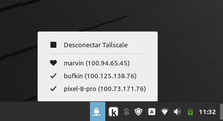

# 🛡️ Tailscale Monitor for Cinnamon

Un Applet nativo y minimalista para el escritorio **Cinnamon** (Linux Mint) que permite gestionar tu red **Tailscale** directamente desde el panel del sistema. Diseñado originalmente para ser ligero y eficiente en hardware clásico (MacBook Pro 2009 "Marvin").

---

## ✨ Características

* **Estado en el Panel:** Icono dinámico que cambia según el estado de la conexión (VPN activa o desconectada).
* **Control One-Click:** Conecta (`up`) y desconecta (`down`) Tailscale mediante la interfaz gráfica segura `pkexec`.
* **Monitor de Dispositivos:** Lista desplegable con todos los equipos de tu Tailnet identificados por iconos:
    * ❤️ **Corazón:** Tu equipo local (Marvin).
    * ✅ **Letra V:** Equipos activos y conectados en la red.
    * ⚪ **Círculo:** Equipos en standby o inactivos.
* **Copiado Rápido:** Al hacer clic en cualquier equipo de la lista, su dirección IP se copia automáticamente al portapapeles.
* **Filtro Inteligente:** Limpia automáticamente avisos de DNS o avisos de salud del sistema para mantener una lista limpia.

---

## 🚀 Instalación

### 1. Requisitos del sistema
Para que el Applet funcione correctamente, necesitas tener instalados `tailscale` y `xclip`:

`sudo apt update && sudo apt install tailscale xclip`

### 2. Descargar el Applet
Clona este repositorio en la carpeta de Applets de tu usuario:

`cd ~/.local/share/cinnamon/applets/`

`git clone https://github.com/xascorro/tailscale-monitor-xas.git tailscale-monitor@xas`

---

## ⚙️ Activación

1. Haz clic derecho en tu **Panel de Cinnamon**.
2. Selecciona la opción **"Applets"**.
3. Busca **"Tailscale Monitor"**.
4. Selecciónalo y haz clic en el botón **(+) Añadir al panel**.

---

## 🛠️ Desarrollo

Para ver los logs en tiempo real:
`tail -f ~/.xsession-errors | grep tailscale-monitor`

Para aplicar cambios es necesario reiniciar Cinnamon, pulsa `Alt + F2`, escribe `r` y pulsa `Enter`.

---
**Made with ❤️ by [Pedro Díaz](https://pedrodiaz.eu)**

GitHub: [@xascorro](https://github.com/xascorro)